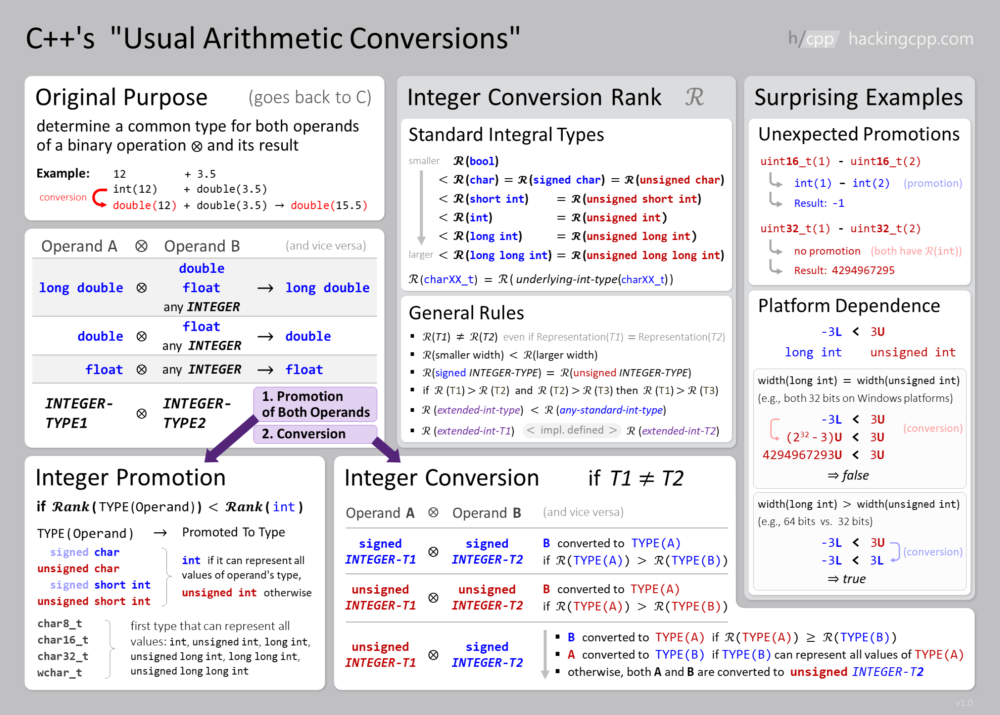

#c-cpp
## 2023.08.21

> https://hackingcpp.com/cpp/lang/fundamental_types.html

## Type narrowing

```cpp
int i = 2.5; // **NARROWING** double → int 
int j = u; // **NARROWING** unsigned int → int 
int k = f; // **NARROWING** float → int
```

Use c++11 braced initialization [[cpp-construct-use-parentheses-vs-braces.md]]

```cpp
int i {2.5}; // COMPILER WARNING: double → int 
int j {u}; // COMPILER WARNING: unsigned int → int 
int k {f}; // COMPILER WARNING: float → int
```

## Arithmatic conversions and promotions

**Operations Involving At Least One Floating-Point Type**

-   `long double` ⊕ any other type → `long double`
-   `double` ⊕ `float` → `double`
-   `double` ⊕ `any integer` → `double`
-   `float` ⊕ `any integer` → `float`

**Operations On Two Integer Types**

1.  **integer promotion** is first applied to _both_ operands:  
    basically everything smaller than **int** gets promoted to either **int** or **unsiged int** (depending on which can represent all values of the unpromoted type)
2.  **integer conversion** is then applied if both operand types are different
    
    -   both signed: smaller type converted to larger
    -   both unsigned: smaller type converted to larger
    -   signed ⊕ unsigned:
        
        1.  signed converted to unsigned if both have same width
        2.  otherwise unsigned converted to signed if that can represent all values
        3.  otherwise both converted to unsigned

!!! Danger Caution: Unexpected promotion when using `uint16_t`
        

