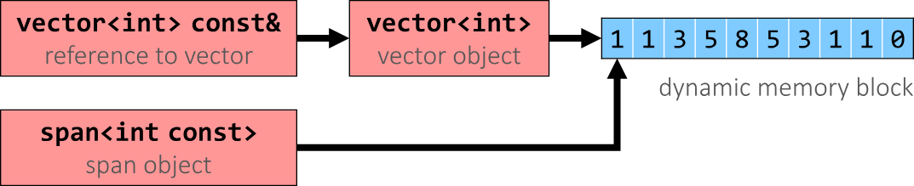

#c-cpp/cpp20 #c-cpp/cpp17
## 2023.08.29

> https://hackingcpp.com/cpp/std/sequence_views.html

## `string_view` (cpp17)

The traditional choice `std::string const&` is problematic:

-   A `std::string` can be constructed from string literals or an iterator range to a `char` sequence.
-   If we pass an object as function argument that is not a string itself, but something that can be used to construct a string, e.g., a string literal or an iterator range, a new temporary string object will be allocated and bound to the const reference.

```cpp
#include <vector>
#include <string>
#include <string_view>

void f_cref (std::string const& s) { … }
void f_view (std::string_view s) { … }

int main () {
  std::string stdStr = "Standard String";
  auto const cStr = "C-String";
  std::vector<char> v {'c','h','a','r','s','\0'};
  f_cref(stdStr);                 // no copy
  f_cref(cStr);                   // temp copy
  f_cref("Literal");              // temp copy
  f_cref({begin(v),end(v)});      // temp copy

  f_view(stdStr);                 // no copy
  f_view(cStr);                   // no copy
  f_view("Literal");              // no copy
  f_view({begin(v),end(v)});      // no copy
}
```

### Make string_view

**With Special Literal `"…"sv`**

```cpp
#include <string> 
#include <string_view> 
#include <iostream> 

int main () {
using namespace std::string_view_literals;
auto literal_view = "C-String Literal"sv;
std::cout << literal_view;
}
```

!!! Danger Careful: View might outlive string!

    ```cpp
    std::string_view sv1 {std::string{"Text"}};
    cout << sv1; //  string object already destroyed!
    using namespace std::string_literals;
    std::string_view sv2 {"std::string Literal"s};
    cout << sv2; //  string object already destroyed!
    ```


## `span` (cpp20)

### Make spans

**As View of Whole Container/Range:**

```cpp
std::vector<int>  w {0, 1, 2, 3, 4, 5, 6};
std::array<int,4> a {0, 1, 2, 3};

// auto-deduce type/length:
std::span sw1 { w };  // span<int>
std::span sa1 { a };  // span<int,4>

// explicit read-only view:
std::span sw2 { std::as_const(w) };
```
### Making Spans From Spans

```cpp
std::vector<int> v {0,1,2,3,4,5,6,7,8};
std::span s = v;

auto first3elements = s.first(3);
auto last3elements  = s.last(3);

size_t offset = 2;
size_t count = 4;
auto subs = s.subspan(offset, count);
```

### Compare

```cpp
#include <algorithm>  // std::ranges::equal
std::vector<int> v {1,2,3,4};
std::vector<int> w {1,2,3,4};
std::span sv {v};
std::span sw {w};
bool memory_same = sv.data() == sw.data();  // false
bool values_same = std::ranges::equal(sv,sw);  // true
```


