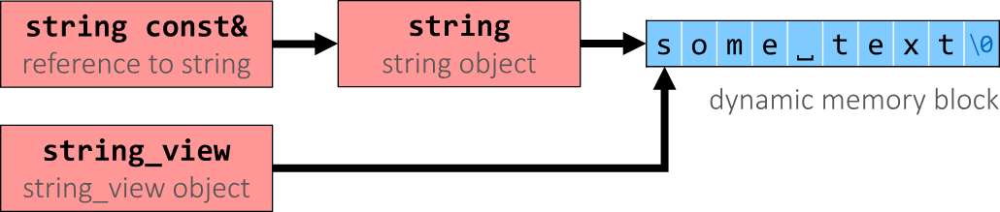

#c-cpp/cpp14 #c-cpp/cpp17
## 2023.08.21

> https://hackingcpp.com/cpp/std/string_basics.html

## `"std::string Literal"s`  **C++14**

```cpp
#include <iostream>
#include <string>

int main () {
using std::cout;
using namespace std::string_literals;
auto s1 = "seven of"s;  // type of s1 is std::string
auto s2 = s1;           // s2 is a copy of s1
s1 += " nine";          // 
cout << s1 << '\n';     // seven of nine
cout << s2 << '\n';     // seven of
auto s3 = "uni"s + "matrix"s;  // 
cout << s3 << '\n';     // unimatrix
```

!!! Try `to_string`, `contains`


## Raw String Literals  `R"(...)"` Raw

Advantage: special characters can be used without escaping

| ------------------------------------- | ------------ | ----- |
| R"(raw "C"-string c:\\users\\joe)"    | char const[] | C++11 |
| R"(raw "std"-string c:\\users\\moe)"s | std::string  | C++14 |

**Syntax:** `R"DELIMITER(characters…)DELIMITER"`

where `DELIMITER` can be a sequence of 0 to 16 characters except spaces, `(`, `)` and `\`

## Use `std::string_view` for read-only parameters!  **C++17**

-   lightweight  (= cheap to copy, can be passed by value)
-   non-owning  (= not responsible for allocating or deleting memory)
-   read-only view  (= does not allow modification of target string)
-   of a string(-like) object  (`std::string` / `"literal"` / …)
-   primary use case: read-only function parameters

```cpp
#include <string>
#include <string_view>
int edit_distance (std::string_view s1,              std::string_view s2) { … }
std::string input = "abx";
int dist = edit_distance("abc", input);
```

-   avoids expensive temporary strings when string literals are passed to functions
-   can speed up accesses by avoiding a level of indirection:
    
    

We will learn more about `string_view` and other view types later.