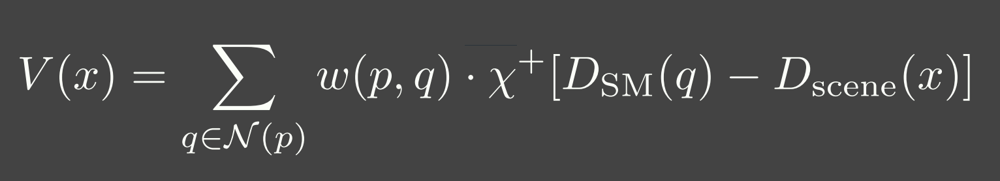
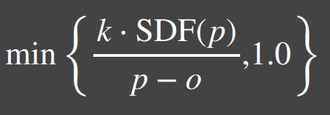
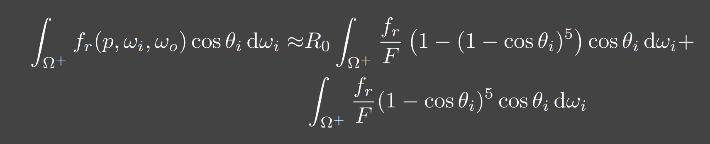
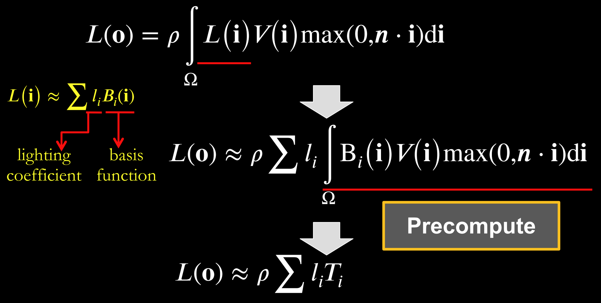
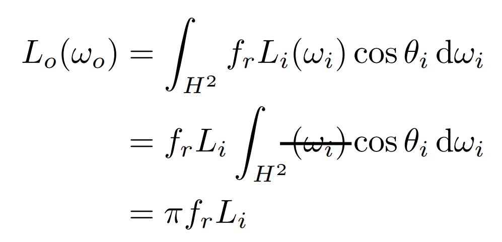
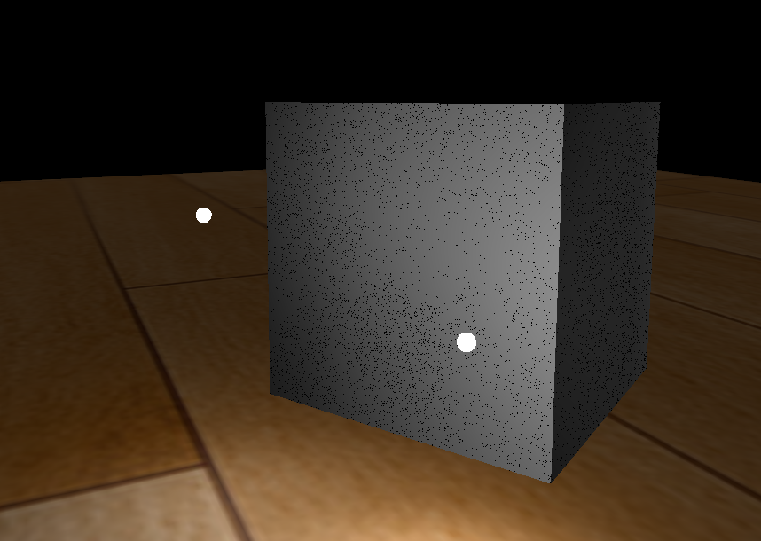

#cg 
## 2023.04.04

## Rasterizer

- 流程

  应用阶段：

  几何阶段：顶点着色器（缩放，旋转，平移），曲面细分着色器（对三角形面进行细分），几何着色器（增加或删除图元）

  光栅化：图元组装（裁剪，背面剔除），屏幕映射（透视除法，视口变换），三角形组装，三角形遍历，片元着色器

  测试混合：裁剪测试，alpha测试，模板测试，深度测试，alpha混合

- 光照模型
  - Lambert:

    环境光＋方向光

    Diffuse * Ambient + Diffuse * LightColor * dot(N, L)

  - Phong: 

    漫反射（考虑光从哪个角度过来所能打到的面积）＋环境光＋高光项（考虑反射向量与光线方向夹角）

    kd * (I / r^2) * max(0, dot(N, L)) + Ambient + ks * (I / r^2) * max(0, dot(L, R))

  - Blinn-Phone:

    将高光项进行更改，考虑半程向量与法线进行点乘

## AA

- SSAA

  超分辨率，对每一个pixel的多个sample都进行一次着色

- MSAA

  对同一个pixel产生的多个sample点只计算一次着色，共享当次着色结果

- TAA

  每帧采样时，将采样的点进行偏移，Halton采样序列（改写投影矩阵）

  Motion Vector处理动，且clamp至合理范围内，如AABB包围盒内，$3\sigma$内

- FXAA(Fast Approximate Anti-aliasing)

  - 算法过程（quality）
  
    1. 计算对比度（周围5个点的亮度极差NEWS），对比度较小可以不进行抗锯齿

    2. 计算混合系数，用总共周围9个点进行计算

    3. 计算混合方向，分别计算水平方向与垂直方向的亮度变化，再计算是上下还是左右

    4. 按混合系数权重进行采样，也就是往变化方向大的方向偏移一点采样作为输出颜色

  - 考虑边界并不是水平或者垂直

    延边界两侧方向查询找到边界，再计算混合系数，混合系数取最大值

  - 算法过程（Console）
    
    - 以半像素采样斜对角线的点，然后计算边界法线方向

    - 往x和y方向分别偏移uv再平均

    - 斜向较好，水平不佳
    
      因此可以将切线的左右点往两边拉长，即变得更水平。但要注意如果拉长后的采样到了亮度变化较大的地方需要舍弃

  - Cons:

    光照高频(颜色变化很快)的地方会不稳定，移动时会有闪烁现象


## Ray tracing

- 辐射度量学

  

- 渲染方程

  Describes how much light is reflected into each outgoing direction

  入射考虑的是irradiance，出射考虑的是radians 

  入射光通常用辐射率来描述。这是因为我们通常关心的是单位面积上接收到多少光能量，并且假设这些光是均匀地分布在半球形的方向上的。对于出射光，我们则使用辐射亮度，因为我们需要知道从表面某一点沿着特定观察方向的光线强度有多大。

  

  辐射亮度（Radiance）和辐射率（Irradiance）之间的转换依赖于表面的几何特性以及观察或入射光线的方向。辐射率是从所有可能方向上入射光的辐射亮度的累积。

  以下是从辐射亮度到辐射率的基本公式：
  $ E = \int_{\Omega} L(\omega) \cos(\theta) d\omega $

  

  $L_o(p, \omega_o) = L_e(p, \omega_o) + \int_{\Omega} f_r(p, \omega_i, \omega_o) L_i(p, \omega_i) (\omega_i \cdot n) d\omega_i$  
  $(ω_i · n)$：入射方向和表面法线 $n$ 的点积，表示入射光线与表面的夹角余弦，是几何项的一部分，用于调整光线与表面交互的影响。

  实际上就是把brdf的分母消掉了，计算的是p点往半球方向发射的radians总和，但是在模拟时候brdf是由真实物理模拟得到的固定函数，$L_i$是由半球面上其他光源（或间接光源给出的）


- 光线追踪模型

  - **Whitted-style**

    直接光照＋反射光照＋折射光照

  - **Path tracing**（SVGF空间滤波，时序滤波）

  - Distributed ray tracing

  - Bidirectional path tracing(BDPT)
  
    顶光（没有直接光照）

  - Metropolis light transport(MLT)

    使用MCMC获得更多临近的sample满足可以从light到view，在光路复杂时很好

  - Photon mapping

  - Vertex Connection and Merging

  - Instant Radiosity

- 加速结构

  - 八叉树

  - KD树（每次划分一半，按xyz三个轴的顺序进行划分）

  - BSP树（多边形对齐bsp树）（Binary Space Partitioning）

  - BVH（Bounding Volume Hierarchies）

- RTRT

  - **Denoising**

  - Temporal Failure

    Temporal Clamping（更愿意相信当前帧） tradeoff between noise and lagging

  - Spatical filter 

    保留高频

    - Joint Bilateral filtering（用其他信息作为指导进行滤波）

      - SVGF

        Depth：梯度

        Normal：次方

        Luminance：空间时间上的平均

      - RAE

        U-Net

## Shadow

  拆分V项考虑阴影构成

  

  - PCF(Percentage Closer Filtering)

    - 为解决自阴影（以像素中心作为整个像素的深度导致精度不够）问题，可将场景深度增加一个偏移，但会导致接触处的阴影消失

      slope bias根据斜率决定bias大小

      

    - 可见处为1，因为V表示可见程度

      


  - PCSS(Percentage Closer Soft Shadow)

    1. Blocker search 

    2. Penumbra estimation(过滤大小估计)

    3. Percentage Closer Filter

  - VSSM(Variance Soft Shadow Mapping)

    - 第一步要获得当前区域中遮挡物深度均值

      考虑使用cdf进行估计，有切比雪夫不等式，则需要知道均值和方差
    
      Average and variance of Block distance(depth): 
      
      - MIPMAP(FAST, APPROXIMATE, SQUARE)

      - SAT
    
    - 第三步是当前区域中有多少像素深度比当前低，同样可以通过切比雪夫估计

    - Moment shadow mapping

      使用更精确的方式表示分布函数
  
  - DFSS(Distance Filed Soft Shadow)

    用于获得每次移动的距离，以及在该点的可视角度（用于估计V）

    

    k越大越硬

  - CSM(Cascaded shadow map)
    
    可提高shadow map精度，针对视锥体中不同位置使用不同光锥体进行渲染
    
    每一级的CSM阴影分辨率在投影到摄像机屏幕空间时，有相似的分辨率

    - 在渲染视角附近的物体时需要更高的shadow map精度

    - 指数分布的CSM或自指定

    - 光锥体的选取：可考虑方形或球形包围盒

    - 在overlapping处进行blend(LoD的通病)

    - Stablize CSM: 视锥体发生变化，就会造成两帧直接的阴影位置不一样，抖动现象

      将相机的移动分成两个部分来处理，分别是相机的旋转和平移

      - 旋转：球形 Bounding volume 是不变的

      - 平移：偏移投影矩阵，从原点变换至shadow map坐标，进行对齐

## Physically Based Environment Lighting

- **IBL(Shading from environment light)**

  避免采样，解析解。没有阴影因为没有考虑V项

  

  For BRDF glossy(small support) or diffuse(smooth)

  1. Left: 对光源的平均即是对环境光贴图做模糊后直接取样

  2. Right: Precompute

    

    转化成关于$cos \theta$和roughness的函数，texture保存

  - 分成Diffuse和Specular分别考虑

  !!! 对于Diffuse可以有 $$L_o(p,\omega_o)=k_d\frac{c}{\pi}\int_{\Omega}{L_i(p,\omega_i)n\cdot \omega_i \textrm{d}\omega_i}$$

    diffuse 项中kd与视线角度有关，通过近似将其提出，得到预计算部分仅与法线，光线方向相关，预计算cubemap(irradians map)

- PRT(Precomputed Radiance Transfer)(Shading and **Shadowing**)

  SH函数，可旋转

  - Diffuse

    

    
    
    Light transport 可以看作球谐函数基函数直接做光照

  - Glossy

    Light transport 作为一个与观察方向o相关的一个函数，即一个Matrix

    

  - Interreflections and Caustics

    都是需要预计算Light transport项

  - Wavelet transformation
    
    会保留高频信息

  - PRTGI

    将光照信息使用SH保存在场景的各个probe当中

    - 数据结构

      Surfel：保存自己的position，normal，albedo

      Brick：保存Surfel索引

      Probe：保存自己位置，对自己产生影响的Brick索引，天空可见性（可解决远距离的AO）

    - 烘焙

      由Probe发射光线进行求教，将数据保存到Surfel中（即预计算光线追踪的几何部份）

    - 在运行时通过保存的几何信息，动态计算irradiance（也可预先烘焙），再将信息编码到probe上

    - Cons

      一般对per object进行四面体插值（当物体过大时不准确），可通过将SH信息pack到体素上（即长方体），对于每个像素获取其周围8个进行插值

    - 对于多次弹射可以复用上一帧的结果

## GI

  one bounce indirect illumination

- RSM(Reflective Shadow Maps)

  考虑直接光源照到的地方成为第二光源进行补光

  假设反射源必须是diffuse，以获得均匀Li。假设以shadow map距离作为世界空间距离

  - 数据需求

    深度，世界坐标，法线，反射光功率（功率是因为便于计算，不需要除以面积或立体角）

  - Cons:

    并不是每一个pixel都可以为其它地方补光（V的问题）（也就是有无意义点），考虑采样（为保证一致性预计算一个采样图案），也就是采样该像素周围的点

- LPV(Light Propagation Volumes)

  找第二光源 -> 划分小格记录 radiance(可使用SH函数记录) -> 演算 -> Render
 
  Radiance 在传输过程中不会衰减

  - Cons:

    小格划分问题，可能会出现 **light leaking**

- VXGI(Voxel Global Illumination)

  基于体素，two pass

  - Pass1: 获取场景中的各项属性（简介光照和法线分布）

  - Pass2: 有类似的层级保存，根据cone的大小逐层获取信息。glossy的就发一个cone，diffuse的发多个。

- SSAO(Ambient Occlusion)

  AO解决的是几何上被遮挡的接收不到环境光的部分

  假设来自各个方向的间接光是相同的，但考虑每一点的V是不同的，diffuse

  

  - kA的计算方法

    - ray tracing（对室内环境是一定被遮蔽）

    - 使用z-buffer计算ka项，撒点sample然后比较

      但在Sample时会有很大问题，球形采样情况下对于平地来说有一部分点会在几何体内部，一定是照不到光的，导致画面变暗

      屏幕空间带来的问题，距离采样点实际很远但是屏幕空间遮挡时会有假阴影

  - 优化kA计算

    复用上一帧AO信息

    降采样计算AO（因为最终都需要对画面进行降噪）

- HBAO

  找半球被遮挡面积，视角与障碍物交点

  ~~需要法线信息，采样更自由，可以加权采样~~

- SSDO(Directional Occlusion)

  

  AO考虑被挡住了就没法被外部照到了，由远处给我打光

  DO考虑远处的点打不到我这点光，由近处的点给我打光

  indir来自对周围点Sample做光照
  
  - Cons
    
    远处的光就照不到了

- [SSR](https://blog.csdn.net/ZJU_fish1996/article/details/89007236)

  - 算法过程

    1. 在屏幕空间中找到对应的反射点
  
      - Hierarchy ray tracing
  
      - Depth buffer Min pooling
  
    2. shading
  
      反射物（次级光源）是 diffuse 的
  
      有反射点信息作为Li，只需要按照渲染方程直接计算即可，glossy的需多采样
  
      重要性采样，时空复用，预过滤（做模糊，单次查询）
    
  - 可以做各种反射，不止specular，因为可以做ray tracing
  
  - 实现问题

    只有屏幕空间信息（其他部分使用RTRT）

    比较域值过大，会导致冗余反射

    步长过大，带状的反射

- DDGI(Dynamic Diffuse GI)基于Light Probe

  - 数据结构

    1. 球面上的diffuse irradiance(E)

    2. 球面距离

    3. 球面各点到最近几何体的距离平方

  - 由Probe发出光线并记录，使用八面体映射存放在一张texture内

  - 基于RTRT：通过级联不同大小的Probe Volume在摄像机上

  - 烘焙Probe

    - 当前帧进行若干光线的直接光照计算（延迟渲染，先记录到G-buffer）

    - 用上一帧的DDGI Volume来计算交点的间接光照，获取到的是L，通过蒙特卡洛算E（因为我们要记录E）

    - 从Position texture中更新depth

    - 每次更新时并不需要更新所有的Probe，通过状态来查询哪些Probe需要被更新

  - Shading

    只计算Diffuse，根据渲染方程可得只需要E，则可以插值获得

    Probe权重由三线性插值，法线与方向，遮挡物（切比雪夫不等式）决定

  - Probe漏光问题

    - 标记法

    - 法线与像素和probe连线夹角解决
    
    - 存储 E(x) 和 E^2(x) 然后做切比雪夫的

    - 存储探针可见性 z buffer 的
    
    - 直接打光线判断可见性

## PBR

- BRDF

  - Diffuse

    - Lambert（传统型）
      
      Supoose light is equally reflected in each output direction

      

      出射光均匀分布在半球面上，所以单方向出射等于总出射除以半球积分，而总出射由能量守恒等于反射率乘p点辐照度

      $$ L_o = \frac{P_{reflected}}{\pi} = \frac{\rho E}{\pi} $$

      而根据BRDF的定义

      $$ L_o = f_r(\omega_i, \omega_o) E $$

      !!! $\rho$ 即为 albedo

    - 基于物理型

  - Specular(Microfacet Cook-Torrance BRDF)

    

    分母中与v的夹角是因为要计算radians，4是因为计算过程中有$\mathrm{d}\omega_i$和$\mathrm{d}\omega_o$的比值，通过半程向量的对应关系计算之后有一个4，G项携带了与l的夹角

    - F

      Reflectance depends on incident angle (and polarization of light)

      越靠近gressing angle反射越强

      M(决定k)R（决定D和G） 和 S

      - Fresnel Equation

        

      - Schlick 

        

        Fresnel项F可以直接用于Ks，而1-Ks即为Kd

        clamp避免产生黑点

        ```glsl
        vec3 fresnelSchlick(float cosTheta, vec3 F0) { 
          return F0 + (1 - F0) * pow(clamp(1.0 - cosTheta, 0.0, 1.0), 5); 
        }
        ```
        

    - D

      !!! D项需要计算出在特定的半程向量H下，有多少比例的微观凸起的法线与H对齐，因为只有当微观凸起的法线与H对齐时，光线才会被反射到观察者的眼中。因此，D项是一个概率密度函数，表示在给定的H方向上，法线分布的密集程度。

      给定以h为中心的无穷小立体角$\mathrm{d} \omega$和无穷小宏观平面$\mathrm{dA}$，$D(m)\mathrm{d}\omega\mathrm{dA}$是相应微表面部分总面积，即描述了有多面少面积会往该方向反射。


      - 在法线方向积分D即面积（微表面的总面积始终不小于宏观表面总面积）

      - 投影到宏观平面积分结果为1（若观察方向为法线方向，则其积分可以归一化。即v = n时）

        

      - 投影到垂直于观察方向的平面进行积分等于该宏观平面的大小（任何方向上微观表面投影面积始终与宏观表面投影面积相同）

        

      - 常用分布函数

        一般考虑半程向量(此处为m)与法线的夹角

        - Blinn-Phong分布

        - Beckmann分布(Cook-Torrance)

          

        - GGX（Trowbridge-Reitz）分布

          

          !!! $\alpha = roughness^2$

          ```glsl
          float DistributionGGX(vec3 N, vec3 H, float roughness) {
            float a = roughness * roughness;
            float a_square = a * a;
            float nh = dot(N, H);
            float denom = (nh * nh) * (a_square - 1) + 1;
            denom = PI * (denom * denom);
            return a_square / denom;
          }
          ```

        - Generalized-Trowbridge-Reitz（GTR）分布

      - 形状不变性（shape-invariant）是一个合格的法线分布函数需要具备的重要性质。具有形状不变性（shape-invariant）的法线分布函数，可以用于推导该函数的归一化的各向异性版本，并且可以很方便地推导出对应的遮蔽阴影项G。(Beckmann GGX)

    - G

      光有D不行，还需要知道可见法线的分布，因此需要G1。
      
      Shadow-mask，G2(微平面BRDF一般就是G2)还考虑光照的可见性。

      1.  **遮蔽（Shadowing）**：描述了微表面凸起如何阻挡从光源传来的光。当光源位于表面平面之下时，这种遮蔽现象更为显著。(NdotL)
      2.  **掩蔽（Masking）**：描述了微表面凸起如何阻挡从观察者方向出发的光线。当观察者的视线位于表面平面之下时，掩蔽现象更为显著。(NdotV)

      几何函数的解析形式的确认依赖于法线分布函数以及几何函数的模型（即微表面轮廓）。

      - 常用G函数

        - V腔遮蔽函数(Cook-Torrance)

        - Smith

          GeometrySmith通常通过两个独立的函数来估计遮蔽和掩蔽效应：一个是与光线方向相关的G1(L)，另一个是与视线方向相关的G1(V)。最终的几何项G可以通过结合这两个单独的函数来得到，往往是以乘法形式：
          
           $$ G(N, V, L, \alpha) = G1(N, V, \alpha) \cdot G1(N, L, \alpha) $$

          

          $\Lambda$ 表示微表面斜率上的积分，有形状不变性的D能推出解析式

          可计算：
          
          $$ G1_{SchlickGGX}(n,v,k)=\frac{n \cdot v}{(n \cdot v)(1 - k) + k} \\ $$
          $$ k_{direct}=\frac{(\alpha + 1) ^ 2}{8} \\ $$
          $$ k_{direct}=\frac{\alpha ^ 2}{2} $$

      - 分离的遮蔽阴影函数

        考虑遮蔽（masking）和阴影（shadowing）独立的，将G项拆成两项相乘

      - 多重散射微平面BRDF

        模微平面模型时所做出的单散射假设，没有模拟微表面上的多次散射
      
        能量损失，需要把能量补回来

## Post Processing

- Bloom

  down sample 后 blur 相加

- Tone Mapping

  解决曝光，色偏问题

- Color Grading

  LUT(Look up table)，做颜色的映射


## Deferred Shading

- 流程

  1. 第一个pass渲染G-buffer

  Postion xyza,
  Normal xyza,
  Albedo xyz
  Specular a

  

  2. 第二个pass计算光照

- 解决问题

  多光源情况下渲染复杂度过高

- Cons

  - 一般不支持MSAA：
  
    你不能在G-buffer中保存抗锯齿后的数据，多倍G-buffer也没有顶点信息，无法插值获取中心信息

    MSAA发生在着色阶段之前，你需要有几何信息，但G-buffer会丢失几何信息
    
    但可以考虑通过某些手段将丢失的信息补充回来

  - 无法渲染透明物体：没有办法在G-buffer的一个像素点中保存那么多信息

  - 带宽大：G-buffer需要保存很多东西

  - 只能使用一个光照pass，同理是因为丢失了几何信息

- Forward+

  对视锥体进行细分，只考虑在一个划分里的光源

  - Tailed

  - Grid

- TBDR(Tailed based)

  把屏幕分成小格，计算会受到哪些光照停下，进行分块处理

- Deferred lighting

  考虑减少G-buffer的内存消耗，用尽量少的空间存储

  1. pass1保存法线向量和镜面因子

  2. pass2计算光照（漫反射和镜面），写入两个缓冲区

  3. pass3计算着色，可以根据不同mesh使用不同着色，从pass2中读取一些预计算的结果

  4. 渲染半透明

- Z-prepass

  先走一遍光栅化但什么都不做，写入z-buffer