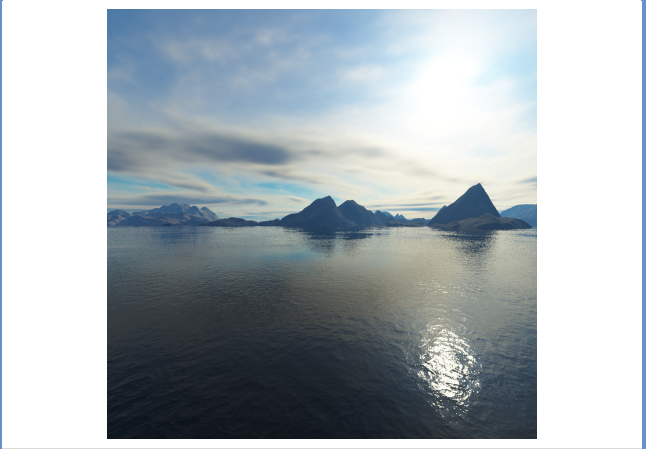

#cg
## 2023.10.19

## Cube map

The sky map is rendered at the outside of the cube model, but we watch it inside, so we will see the x axis is flipped like this:

**Texture to be loaded(back, -z)**



**Camera in Game**


Thus, if you want to sample front face from your captrue, you should filp x axis in sampling.

!!! Note Also to mention, x axis flip means the left and right will be exchanged

It's quite imaginable, suppose you filpped x axis for front, then you want to cancat the left and right to be a long picture, you must exchange the left and right to make them be continuous.

!!! Warning However, the texture stored in memory is y flipped(loaded by stbi library)

When rendering sky box:


When rendering your box:


## Dynamic environment mapping

For a simpest reflection material, we just **sample the reflect vector on sky box texture.** 

Thus, for reflect all objects in the world, we should try to simulate a cubemap totally **the smae as the sky box** texture but adding the world objects.

According to the above statements, if we want to capture the scene in the game then use it as a cube map, we should filp its **x AND y axis** when storing in memory, **or when sampling in shading.**

!!! Warning If you choose to flip x or y when sampling, you should reverse the storage of left and right, or top and bottom, respectively.

Code snippet:

Cpp

```cpp
    // right
    if (debug_sky_map) {
      glViewport(940, 300, 300, 300);
    } else {
      glBindFramebuffer(GL_FRAMEBUFFER, fbo_dem[0]);
    }
    camera.SetYaw(180);
    camera.SetPitch(0);
    DrawScene(delta_time_per_frame, camera);

    // left
    if (debug_sky_map) {
      glViewport(340, 300, 300, 300);
    } else {
      glBindFramebuffer(GL_FRAMEBUFFER, fbo_dem[1]);
    }
    camera.SetYaw(0);
    camera.SetPitch(0);
    DrawScene(delta_time_per_frame, camera);

    // top
    if (debug_sky_map) {
      glViewport(640, 0, 300, 300); // show at bottom
    } else {
      glBindFramebuffer(GL_FRAMEBUFFER, fbo_dem[2]);
    }
    camera.SetYaw(180);
    camera.SetPitch(-90);
    DrawScene(delta_time_per_frame, camera);

    // bottom
    if (debug_sky_map) {
      glViewport(640, 600, 300, 300); // show at top
    } else {
      glBindFramebuffer(GL_FRAMEBUFFER, fbo_dem[3]);
    }
    camera.SetYaw(180);
    camera.SetPitch(90);
    DrawScene(delta_time_per_frame, camera);

    // front
    if (debug_sky_map) {
      glViewport(640, 300, 300, 300);
    } else {
      glBindFramebuffer(GL_FRAMEBUFFER, fbo_dem[4]);
    }
    camera.SetYaw(90);
    camera.SetPitch(0);
    DrawScene(delta_time_per_frame, camera);

    // back
    if (debug_sky_map) {
      glViewport(1240, 300, 300, 300);
    } else {
      glBindFramebuffer(GL_FRAMEBUFFER, fbo_dem[5]);
    }
    camera.SetYaw(-90);
    camera.SetPitch(0);
    DrawScene(delta_time_per_frame, camera);
```

Shader:

```glsl
void main() {
  vec3 V = normalize(ws_cam_pos - P);
  vec3 R = reflect(-V, normalize(N));
  FragColor = texture(skybox, vec3(-R.xy, R.z));
}
```
