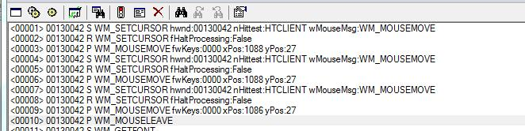

#windows/tool #c-cpp  
## 2021.5.13

### spy++消息查看



- 第一条：<00001> 00130042 S WM_SETCURSOR hwnd:00130042 nHittest:HTCLIENT wMouseMsg:WM_MOUSEMOVE

<00001>：是SPY++捕获到的消息序号，主要是它记录顺序用。

00130042：这是目标窗口句柄的16进制。

S：这里第一行是S，第二行是R，第三行是P。一起说了。S 是指使用 SendMessage 发送的消息，R 是使用SendMessage发送消息后得到的返回值。P 是使用PostMessage 发送的消息。

WM_SETCURSOR：发送的消息值，也就是 SendMessage 的第二个参数（PostMessage 参数与SendMessage的一样）。

从这里往后，就分别是 SendMessage 的第三个参数和第四个参数的值了，但是它们不是固定对应的，是根据具体消息值不同而不同的。

第一条在消息值 WM_SETCURSOR 之后，是 hwnd:00130042，可以看出这是一个句柄，也就是目标窗口的句柄。同时这里是 SendMessage 的第三个参数。

然后在 hwnd:00130042 的后面有两个数据，而我们的SendMessage只剩最后一个参数了，所以后面的两个数据都是SendMessage的最后一个参数。一个低位，一个高位。

SPY++捕获的第一条消息，要使用代码发送实现一样的数据的话，就应该是：

```c++
::SendMessage(00130042, WM_SETCURSOR, 0x00130042, MAKELPARAM(HTCLIENT, WM_MOUSEMOVE));
```

- 第二条：<00002>00130042 R WM_SETCURSOR fHaltProcessing:False

这条不需要我们操作，我们使用SendMessage发送了之后，就会有类似的返回值回来。

- 第三条：<00003> 00130042 P WM_MOUSEMOVE fwKeys:0000 xPos:1088 yPos:27

我们直接说 WM_MOUSEMOVE 之后的东西就行了，WM_MOUSEMOVE包含之前的看上面的第一条。

WM_MOUSEMOVE 之后是 fwKeys:0000 ，因为WM_MOUSEMOVE是PostMessage的第二个参数（为什么是PostMessage而不是SendMessage?上面有说到）

所以这个fwKeys:0000就是PostMessage的第三个参数了，而且值是 0 ，我们不用看前面的 fwKeys ,只需要看 : 后面，它的值就行了。

fwKeys:0000 是第三个参数了，那它之后的就是第四个参数。

同样，还有两个数据，低位和高低。

最后，这条捕获的消息用代码实现就是：

```c++
::PostMessage(0x00130042, WM_MOUSEMOVE, 0, ::MAKELPARAM(1088, 27);
```

> VS2005 我在MFC单文档程序里，想获取View窗体的上下左右四个坐标值，于是使用GetClientRect(**LPRECT** lp)来获取，可是出了问题，问题如下：
> **LPRECT** lp; GetClientRect(lp);
> long viewLength = lp->right-lp->left; long viewHeight = lp->bottom-lp->top;
> 首先，我看GetClientRect方法里带的参数是**LPRECT** lp指针，于是想当然的在前面定义了一个，编译的时候并没有报错，可是在运行的时候报错Run-Time Check Failure # 3 - The variable 'lp' is being used without being defined.
> CRect rc; GetClientRect(&rc);
> long viewLength = rc.right-rc.left; long viewHeight = rc.bottom-rc.top;
> 这是后来修改用的方法 定义一个CRect rc类 把rc的地址作为GetClientRect方法的参数，这样就可以正确的运行了。
> 可是一直不明白 为什么不能直接用开始时定义的**LPRECT** lp来作为GetClientRect方法的参数呢？望知道的告诉下小弟 不胜感激

**LPRECT** lp只是定义了一个DWORD的值，这个值你可以叫指针，也可以叫数值。但其实把这个DWORD当做地址来用时它并不是一个有效地址。这种指针又叫野指针，它不指向任何内存块。所以运行一定会错。