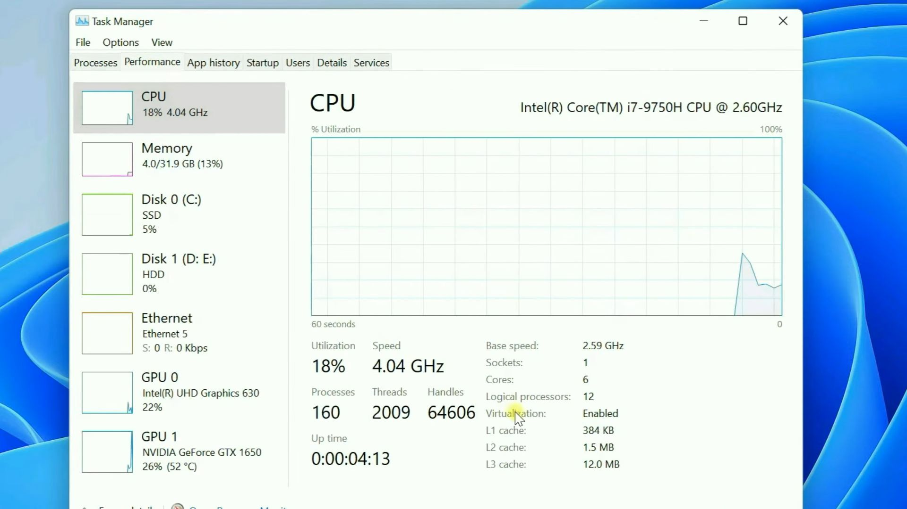
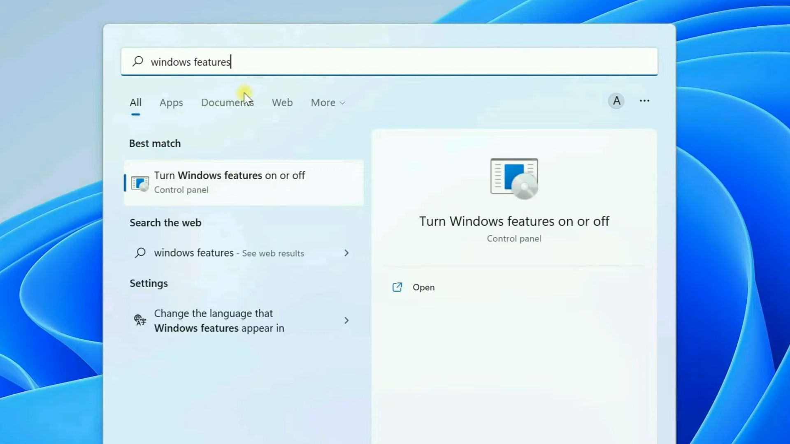
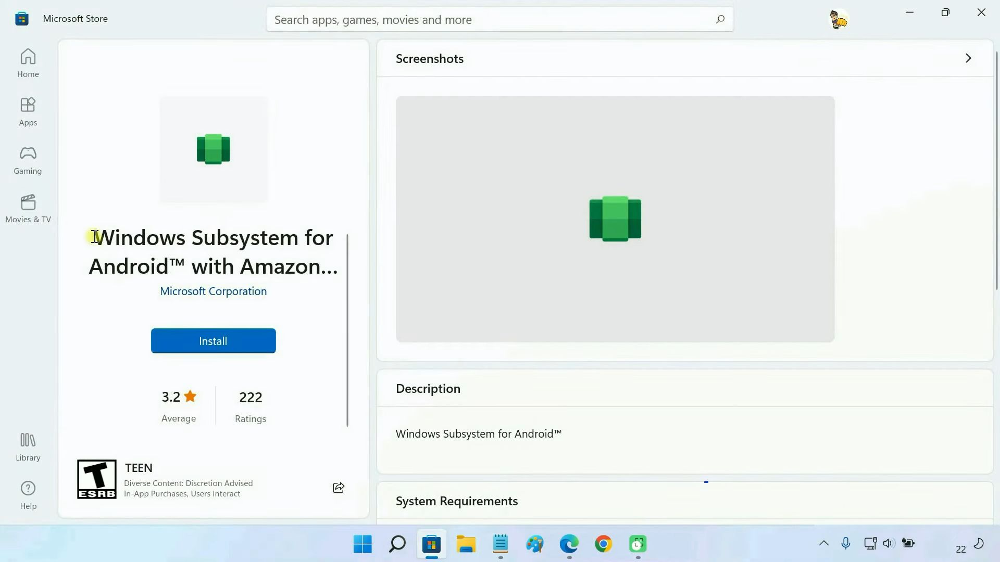
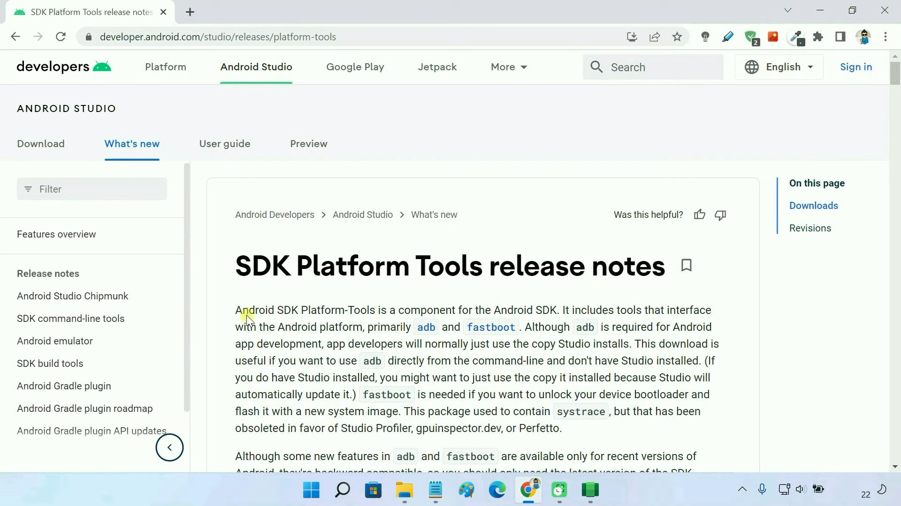
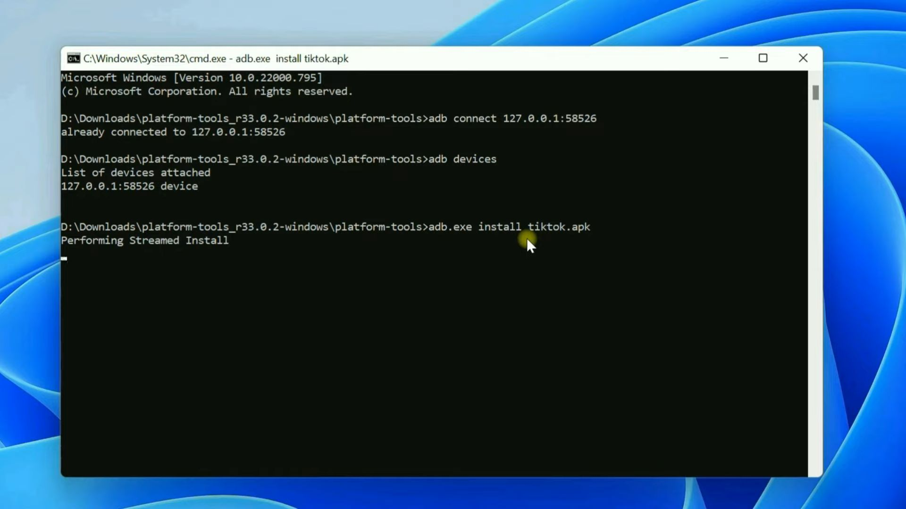

#windows/wsa 
## 2023.08.21

> https://www.youtube.com/watch?v=D_AiqB-eVig

## Installation of WSA

**Enable virtualization**

**Enable virtual machine platform**

**Change your region to US then download amazon appstore, which auto download wsa**

**Turn on developer mode in wsa settings**

## Install apps on WSA

- **wsa-pacman(github)(Recommand)**

- **Apk Installer on WSA**

- **Install via adb**

