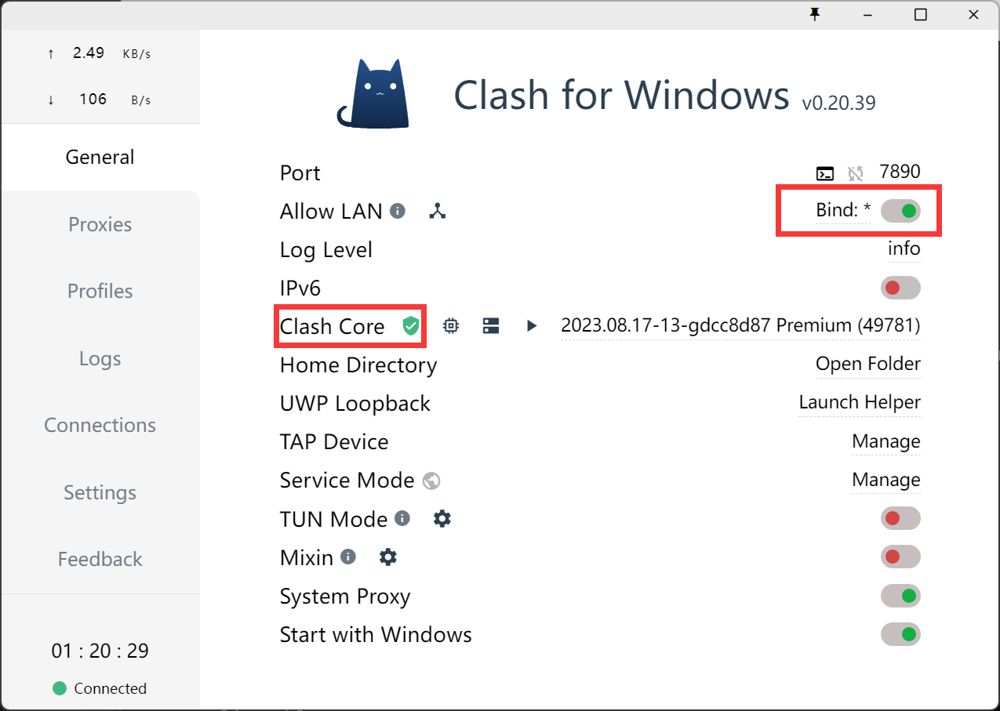

> https://eastmonster.github.io/2022/10/05/clash-config-in-wsl/  
> https://zhuanlan.zhihu.com/p/640242841

## Instruction

**1. Enable `Clash Core`**

**2. Allow Lan**

**3. Config rc file**

```bash
host_ip=$(cat /etc/resolv.conf |grep "nameserver" |cut -f 2 -d " ")
export http_proxy="http://$host_ip:7890"
export https_proxy="http://$host_ip:7890"
```

