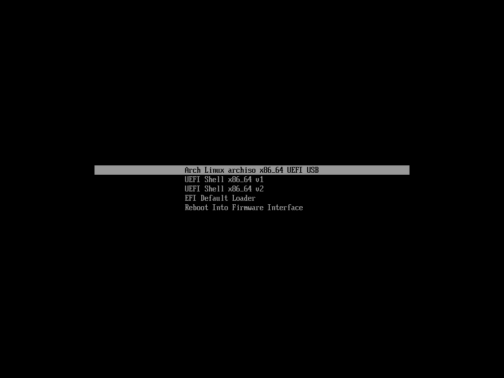

# 2022.5.16

References:
> [Arch Linux + Windows 双系统安装教程](https://blog.linioi.com/posts/18/)
>
> [gentoo linux配置intel和nvidia双显卡电脑，使用prime方案](https://www.jianshu.com/p/515a1f39b438)

## Check the boot mode

Set `Secure Boot` option to `DISABLE` in your BIOS.

Press <kbd>win+r</kbd> and input `msinfo32` to check whether `bios mode` is `UEFI`

This article only intends for `UEFI` boot mode

## Prepare for a bootable usb

Download [Rufus](http://rufus.ie/en/)

Select the Device that you want to burn program in, the iso file at boot selection. Remain default at `Persistent partition size`.

Select `GPT` for `Partition scheme`, `UEFI` for `Target system`. Remain default for Format Options, then press START. Select the recommended option `ISO` and press OK.

## Prepare for free space

Open `Disk management panel` in `Computer management` which can be opened by right click on `This Computer`->`Manage`.

Right click on the disk in which you want to install arch, select `Compress` and separate free space from it. **At least 30G.**

## Set timezone shift on Windows

To avoid some weird problem when you switch system from linux to windows,  run the following command with Admin priority.
```bash
$ reg add "HKEY_LOCAL_MACHINE\System\CurrentControlSet\Control\TimeZoneInformation" /v RealTimeIsUniversal /d 1 /t REG_DWORD /f
```

## Start installation

First, boot your computer from the usb, select the first option

<p align="center">
  
</p>

Connect to network and synchronize time.

- Unblock to the network card
  ```
  $ rfkill unblock all
  ```
- Connect to the network
  ```bash
  $ iwctl # enter iwd shell
  $ device list
  $ station <device> get-networks # list all detected networks
  $ station <device> connect <SSID> # connect
  $ exit # exit iwd shell
  $ ping www.baidu.com # check the connection
  ```
- Synchronize the time
  ```bash
  $ hwclock --systohc --utc
  $ timedatectl set-ntp true
  ```

Format and mount the disks

- Check the disks
    ```bash
    $ fdisk -l
    ```
- Partition the disks
  ```bash
  $ cfdisk /dev/nvme1n1 # select the whole disk, not a partition like nvme1n1p1
  ```
  Divide the free space into two part, like 100G for `/mnt` and 300G for `/mnt/home`, **NOW THE SYSTEM IS BOOTED BY USB, SO THE DISKS ARE MOUNTED ON `/mnt`**

  `UEFI` do not need a `/boot` partition, we just need to mount `/boot` on `WINDOWS EFI`

  Then select `[Write]` and `[Quit]`, you are supposed to input `yes` to confirm.

- Mount the disks
  ```bash
  $ fdisk -l # Check the partition
  $ mkfs.ext4 /dev/nvme1n1p1 # Format /mnt
  $ mkfs.ext4 /dev/nvme1n1p2 # Format /mnt/home
  $ mount /dev/nvme1n1p1 /mnt # Mount /mnt
  $ mkdir /mnt/home
  $ mount /dev/nvme1n1p2 /mnt/home # Mount /mnt/home
  $ mkdir /mnt/boot
  $ mount /dev/nvme0n1p2 /mnt/boot # Mount /mnt/boot
  $ fdisk -l # Check the partition again
  $ lsblk
  ```

Install the system

- Change the mirrors
  ```bash
  $ reflector --country 'China' --age 12 --protocol https --sort rate --save /etc/pacman.d/mirrorlist
  $ pacman -Syy # refresh the mirrors
  ```
- Install kernel
  ```bash
  $ pacstrap /mnt base base-devel linux linux-firmware vim e2fsprogs ntfs-3g 
  # 在上述命令中，base 是元软件包（基本系统所需依赖，你可以不知道它是啥但是必须安装），base-devel 是基础软件包组，linux 是内核，linux-firmware 是固件包，nano、vim 是常用编辑器，e2fsprogs 是 ext4 文件系统所需工具，如果你是按照上面教程使用 ext4 文件系统则必须安装该软件包。ntfs-3g 是与 Windows 的 NTFS 有关的软件包，如果是单系统可以不安装。
  ```
  
  If meet error like this:
  ```bash
  error: libcap: signature from "David Runge <dvzrv@archlinux.org>" is marginal trust
  :: File /mnt/var/cache/pacman/pkg/libcap-2.65-1-x86_64.pkg.tar.zst is corrupted (invalid or corrupted package (PGP signature)).
  Do you want to delete it? [Y/n] 
  error: failed to commit transaction (invalid or corrupted package)
  Errors occurred, no packages were upgraded.
  ==> ERROR: Failed to install packages to new root
  ```
  
  Try
  ```bash
  $ pacman -Sy archlinux-keyring
  ```
  
- Config file system table
  ```bash
  $ genfstab -U -p /mnt >> /mnt/etc/fstab
  $ ls /mnt/etc/fstab # check
  ```

## Install the new system

- Pre-settings
  ```bash
  $ arch-chroot /mnt /bin/bash # Enter the new system
  $ passwd # Set root password
  $ useradd -m -U -s /bin/bash <username> # Create a user
  $ passwd <username> # Set the user password
  ```
- Change the user priority
  ```bash
  $ sudo vim /etc/sudoers
  # add
  %<username> ALL=(ALL) ALL # your group name is same as your user name because the `-U` option 
  ```
- Set the name of your computer
  ```bash
  $ echo <computername> > /etc/hostname 
  ```
- Set up hosts
  ```bash
  $ vim /etc/hosts
  # add
  127.0.0.1	localhost
  ::1		localhost
  127.0.1.1	<computername>.localdomain	<computername>
  ```
- Install microcode
  ```bash
  $ pacman -S intel-ucode # intel
  $ pacman -S amd-ucode # amd
  ```
- Add archlinuxcn source and install yay
  ```bash
  $ vim /etc/pacman.conf
  # add
  [archlinuxcn]
  Server = https://mirrors.ustc.edu.cn/archlinuxcn/$arch
  $ pacman -Syy # refresh
  $ pacman -S archlinuxcn-keyring # install keyring
  $ pacman -S yay
  ```
- Solve the Windows-encryption
  ```bash
  $ yay -S dislocker
  ```
- Set dual-system instruction
  ```bash
  $ pacman -S grub efibootmgr os-prober # install softwares
  $ grub-install --target=x86_64-efi --efi-directory=/boot --bootloader-id=grub --recheck # install to disks
  $ echo "GRUB_DISABLE_OS_PROBER=false" >> /etc/default/grub # enable os-prober
  $ grub-mkconfig -o /boot/grub/grub.cfg # generate config file
  # You would see "Found Windows" or something
  ```

  If there is no output "Found Windows", try following commands:

  ```bash
  $ sudo os-prober # check whether there is a Windows boot file
  # If there actually has, but didn't be recognized, you could do following steps
  $ yay -S update-grub
  $ sudo update-grub
  ```

- Set up language and timezone
  ```bash
  $ vim /etc/locale.gen
  # remove the front '#' of
  en_US.UTF-8 UTF-8
  zh_CN
  zh_TW
  # then run
  $ locale-gen # refresh
  $ echo LANG=en_US.UTF-8 > /etc/locale.conf # set system language to English
  $ ln -sf /usr/share/zoneinfo/Asia/Shanghai /etc/localtime # change timezone
  ```
- Set up network
  ```bash
  $ pacman -S networkmanager
  $ systemctl enable NetworkManager # auto-startup when boot
  ```
- Localize
  ```bash
  $ pacman -S noto-fonts noto-fonts-cjk noto-fonts-emoji adobe-source-han-sans-otc-fonts wqy-microhei wqy-zenhei # install fonts
  ```

## Other configuration

- Grub theme

  [Grub theme](https://www.gnome-look.org/browse?cat=109)

  [My theme](https://github.com/vandalsoul/darkmatter-grub2-theme/)

- vim-like browser

  ```bash
  yay -S w3m
  ```

- Xorg

  [Xorg](https://wiki.archlinux.org/title/Xorg)

  [Xrandr](https://wiki.archlinux.org/title/Multihead)
  
  Display server, for GUI applications. `xrandr` is a tool to custom your display do things like changing resolution, setting up dual monitor etc.
  `xbacklight` is a tool to change the backlight of your screen.
  
  ```bash
  $ yay -S xorg xorg-init
  ```
  
  Mind that [`xbacklight` currently does not work with the modesetting driver](https://wiki.archlinux.org/title/Backlight#xbacklight).

  Use `sudo vim /sys/class/backlight/intel_backlight/brightness` to edit the brightness of the screen.

- Dwm
  
  dependency-lib: `yay -S libxft libxinerama xclip`(xclip is using for patch pipe)

  awesomebar: to hide and showe clients

  cfacts: to resize the clients' window vertically

  hide_vacant_tags: to hide vacant tags

  layoutscroll: to scroll over all layouts

  pertag: to set different layouts in per tag

  viewontag: show all clients' title on bar

  cool-autostart: autostart scripts and close it when quit dwm

  sendmon_keepfocus: send client to other monitors and keep focusing on it
  
- Nvidia driver

  [Nvidia](https://wiki.archlinux.org/title/NVIDIA)

  [Nvidia prime](https://wiki.archlinux.org/title/PRIME)

  `nvidia` is the proprietary Nvidia driver for Nvidia graphic cards, `nvidia-prime` can run a specific application rendering by nvidia card and is only needed by hybird graphic cards like intel+nvidia, amd+nvidia.

  **Note: The computer with intel 12th gen CPU may crash after installing this driver, and the solution is to add a kernel parameter `ibt=off` as the instructions said by [Nvidia installation](https://wiki.archlinux.org/title/NVIDIA#Installation)**

  To do so, edit the `/etc/default/grub`

  ```bash
  $ sudo vim /etc/default/grub
  # add "ibt=off" just at the end of "GRUB_CMDLINE_LINUX_DEFAULT=" line, like:
  GRUB_CMDLINE_LINUX_DEFAULT="loglevel=3 quiet ibt=off"
  # then run
  $ sudo update-grub
  ```
  
  ```bash
  $ yay -S nvidia nvidia-prime 
  ```

  Here are my [xorg.conf](https://github.com/Katzeee/dot-files/tree/master/xorg) files.

- Browser

  Google Chrome browser

  ```bash
  $ yay -S google-chrome
  ```

- Network proxy

  Use ssr protocol proxy for accessing `google` or some else site.

  ```bash
  $ yay -S v2ray qv2ray qv2ray-plugin-ssr
  ```
  
- Sound

  [Alsa](https://wiki.archlinux.org/title/Advanced_Linux_Sound_Architecture)
  
  In order to drive the sound card

  ```bash
  $ yay -S alsa-utils
  ```

- Razer driver

  Driver and GUI for razer mice and keyboards.
  
  ```bash
  $ yay -S linux-headers openrazer-meta-git polychromatic
  ```

- VSCode sync

  ```bash
  $ yay -S visual-studio-code-bin  
  ```
  
  For sync to your github account, you need to install following packages:

  > [settings sync not working on arch linux #113157](https://github.com/microsoft/vscode/issues/113157)
  
  ```bash
  $ yay -S xdg-utils gnome-keyring libsecret
  ```

- Linux Reader

  [Linux-reader](https://www.diskinternals.com/linux-reader/)

  A small program on Windows for accessing the files on Linux.
