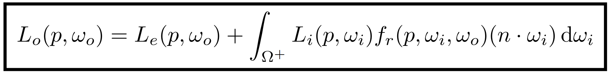
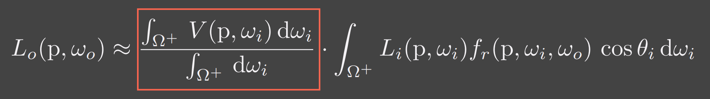
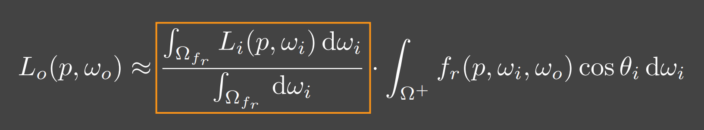
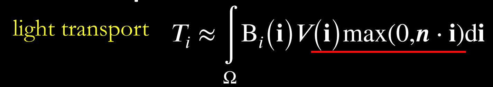
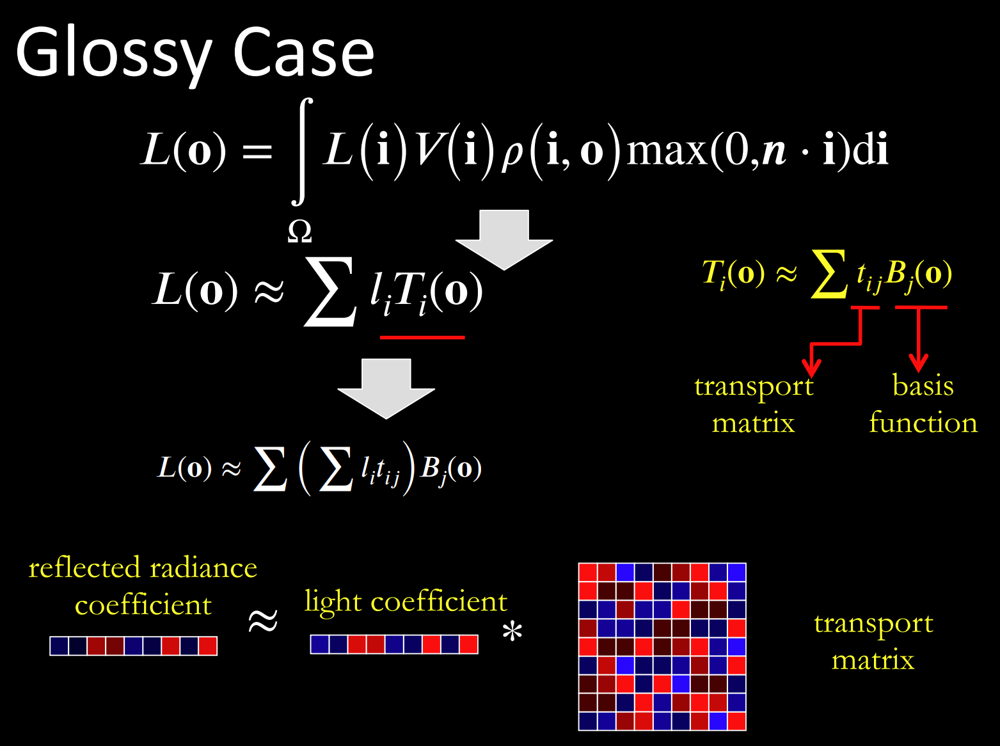
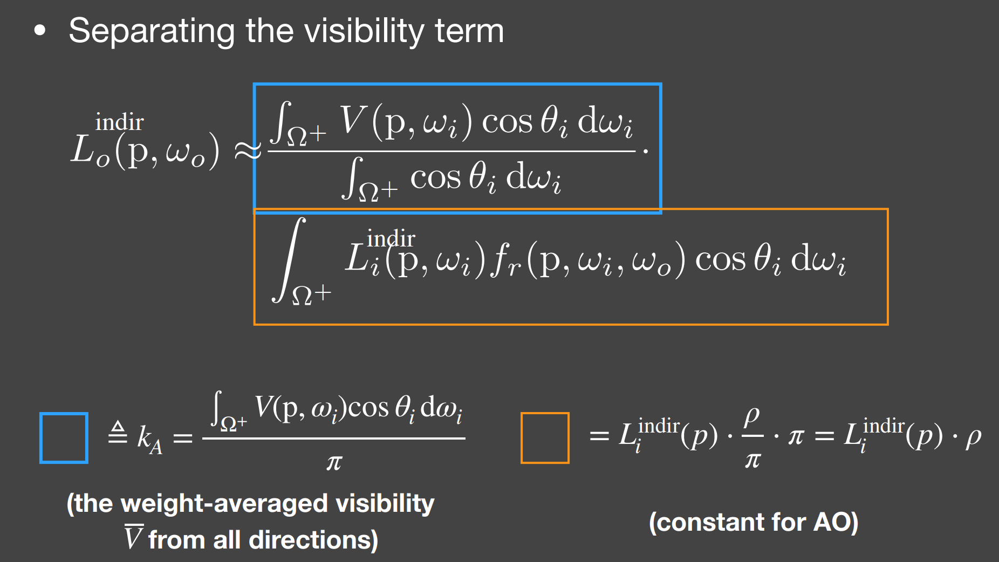
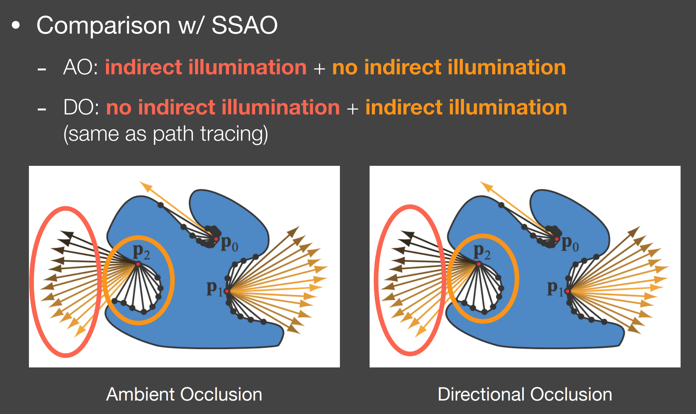
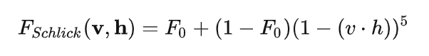

2023.04.04
---

## Rasterizer

- 流程

  应用阶段：

  几何阶段：顶点着色器，曲面细分着色器（对三角形面进行细分），几何着色器（增加或删除图元）

  光栅化：图元组装（裁剪，背面剔除），屏幕映射（透视除法，视口变换），三角形组装，三角形遍历，片元着色器

  测试混合：裁剪测试，alpha测试，模板测试，深度测试，alpha混合

- 光照模型
  - Lambert:

    环境光＋方向光

    Diffuse * Ambient + Diffuse * LightColor * dot(N, L)

  - Phong: 

    漫反射（考虑光从哪个角度过来所能打到的面积）＋环境光＋高光项（考虑反射向量与光线方向夹角）

    kd * (I / r^2) * max(0, dot(N, L)) + Ambient + ks * (I / r^2) * max(0, dot(L, R))

  - Blinn-Phone:

    将高光项进行更改，考虑半程向量与法线进行点乘

## AA

- SSAA

- MSAA

## Ray tracing

- 辐射度量学

  

- 渲染方程

  Describes how much light is reflected into each outgoing direction

  

  

- 光线追踪模型

  - **Whitted-style**

    直接光照＋反射光照＋折射光照

  - **Path tracing**

  - Distributed ray tracing

  - Bidirectional path tracing(BDPT)
  
    顶光（没有直接光照）

  - Metropolis light transport(MLT)

    使用MCMC获得更多临近的sample满足可以从light到view，在光路复杂时很好

  - Photon mapping

  - Vertex Connection and Merging

  - Instant Radiosity

- 加速结构

  - 八叉树

  - KD树（每次划分一半，按xyz三个轴的顺序进行划分）

  - BSP树（多边形对齐bsp树）（Binary Space Partitioning）

  - BVH（Bounding Volume Hierarchies）

## Shadow

   拆分V项考虑阴影构成

  

  - PCF(Percentage Closer Filtering)

    

    可见处为1，因为V表示可见程度

  - PCSS(Percentage Closer Soft Shadow)

    1. Blocker search 

    2. Penumbra estimation(过滤大小估计)

    3. Percentage Closer Filter

  - VSSM(Variance Soft Shadow Mapping)

    - 第一步要获得当前区域中遮挡物深度均值

      考虑使用cdf进行估计，有切比雪夫不等式，则需要知道均值和方差
    
      Average and variance of Block distance(depth): 
      
      - MIPMAP(FAST, APPROXIMATE, SQUARE)

      - SAT
    
    - 第三步是当前区域中有多少像素深度比当前低，同样可以通过切比雪夫估计

    - Moment shadow mapping

      使用更精确的方式表示分布函数
  
  - DFSS(Distance Filed Soft Shadow)

    用于获得每次移动的距离，以及在该点的可视角度（用于估计V）

    

    k越大越硬

## Physically Based Environment Lighting

- IBL(**Shading** from environment light)

  避免采样，解析解。没有阴影因为没有考虑V项

  

  For BRDF glossy(small support) or diffuse(smooth)

  1. Left: 对光源的平均即是对环境光贴图做模糊后直接取样

  2. Right: Precompute

    

    转化成关于$cos \theta$和roughness的函数，texture保存

- PRT(Shading and **Shadowing**)

  SH函数，可旋转

  - Diffuse

    

    
    
    Light transport 可以看作球谐函数基函数直接做光照

  - Glossy

    Light transport 作为一个与观察方向o相关的一个函数，即一个Matrix

    

  - Interreflections and Caustics

    都是需要预计算Light transport项

  - Wavelet transformation
    
    会保留高频信息

## GI

  one bounce indirect illumination

- RSM(Reflective Shadow Maps)

  考虑直接光源照到的地方成为第二光源进行补光

  要求反射源必须是diffuse，以获得均匀Li，(?使用深度直接作为距离)

  - Cons:

    并不是每一个pixel都可以为其它地方补光（V的问题），考虑采样

- LPV(Light Propagation Volumes)

  找第二光源 -> 划分小格记录 radiance(可使用SH函数记录) -> 演算 -> Render
 
  Radiance 在传输过程中不会衰减

  - Cons:

    小格划分问题，可能会出现light leaking

- VXGI(Voxel Global Illumination)

  基于体素，two pass

  - Pass1: 获取场景中的各项属性（简介光照和法线分布）

  - Pass2: 有类似的层级保存，根据cone的大小逐层获取信息。glossy的就发一个cone，diffuse的发多个。

- SSAO

  假设来自各个方向的间接光是相同的，但考虑每一点的V是不同的，diffuse

  

  使用z-buffer直接计算ka项，sample然后比较

- HBAO

  需要法线信息，采样更自由，可以加权采样

- SSDO

  

  AO考虑被挡住了就没法被外部照到了，由远处给我打光

  DO考虑远处的点打不到我这点光，由近处的点给我打光，问题就是远处的光就照不到了

- SSR

## PBR

- BRDF

  - Diffuse / Lambert

    
  
  - Specular(Microfacet Cook-Torrance BRDF)

    

    - F

      - Fresnel Equation

      - Schlick 

        

    - D

    - G

