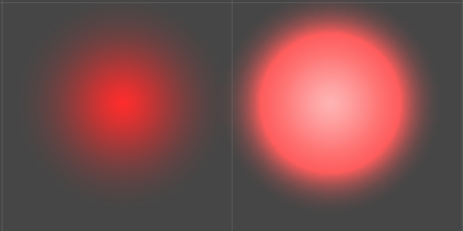
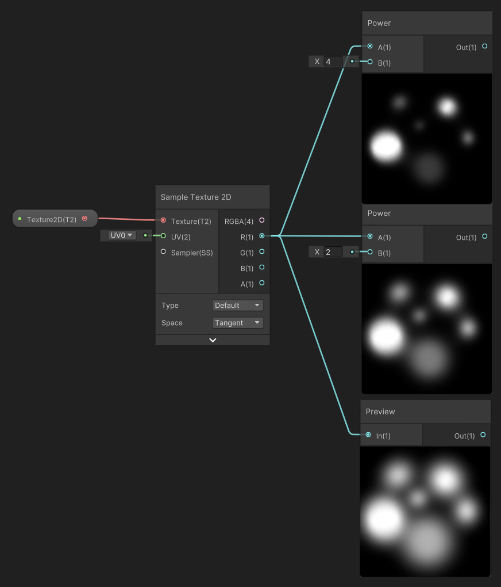
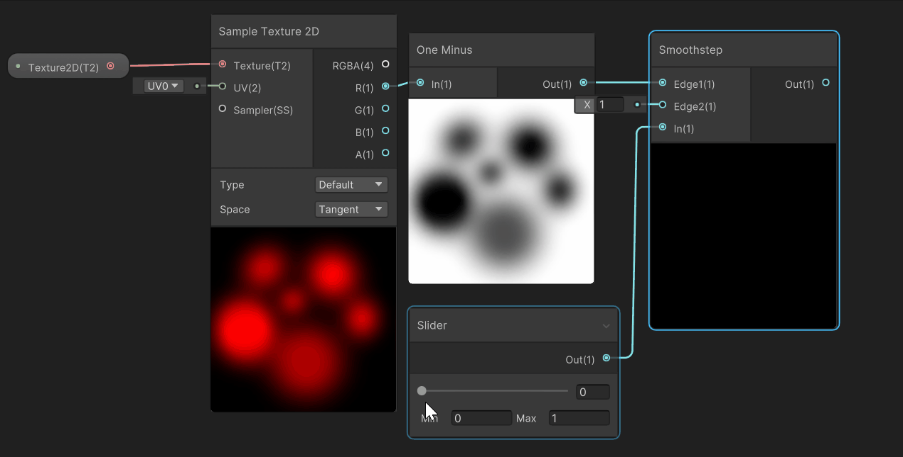

2023.01.31
---

## 关键的结点

- pow

  对于0-1之间的数越pow越小，即越接近0

- clamp

  截断，所有小于min的截断到min，所有大于max的截断到max

- lerp

  由第三个输入T控制给出输入AB中的一个渐变过程，0输出A，1输出B，中间则输出一个融合（渐变）

- one minus

  用于反转黑白区域

- smooth step

  输出为0-1，第一个输入为变化出现的坐标，第二个输入为变化结束的坐标，第三个输入为取样坐标

  函数在第一个坐标前为0，第二个坐标后为1，中间是一个从0-1之间的平滑过渡，可以表达**经过**

  第一个输入与第二个输入越远，过渡越平滑（当第一个输入等于第二个输入时，在图像上表现为分段函数）

- noise, vorinoi

  经常被用来做随机噪声的结点

## 效果的基础

- Alpha通道控制你能看到什么，透明度的概念也可以理解为颜色的强弱

  1表示能看到，0表示看不到，也就是最终输出到A通道上的图片的白色部分是可以看见的，黑色部分是看不见的

- MainTex 主纹理

  - 单通道图片（将Alpha信息放在单通道中，如R通道），无其他颜色信息

    颜色由外部给出，可在shader graph中用vertex color获取外部给出的颜色

  - 启用HDR颜色

    有时颜色是从顶点或贴图获取，此时没有办法直接指定HDR颜色

    将颜色乘以一个数字即可（vertex_color.rgb * hdr_modifier）

    HDR颜色可以让颜色更具表现力，亮的更亮，暗的更暗，亮在颜色中的表现就是变白

    

    左图为modifier为1，即未开启HDR，右图为相同颜色下hdr_modifier为3，可以看到中心位置变白

- Dissolve 溶解

  - 溶解的基础就是让你看不到什么，也就是在透明度上做文章，任何数乘0都变为0，即不可见，

  - 固定位置溶解，也就是你可以用一张新的贴图指出你不想看见的地方，和原A通道输出相乘，以做到控制溶解位置的效果

  - 很多结点都可以控制溶解的强度，比如pow，subtract，也可以结合来使用，用来对溶解贴图做更细致的效果呈现

    

  - 溶解动画

    - 溶解进度

      进度也就是意味着由0（完全不溶解，即DissovleTex完全不影响MainTex）到1（完全溶解，即DissolveTex完全multiple了MainTex）的过程。

      lerp结点在这里就可以起到效果，输入T的0-1范围正好可以控制溶解进度

      

    - 溶解进度2

      上面的方法仅能让DissovleTex缓慢出现，但溶解效果有时不只是需要溶解一半，溶解是为了让物体消失，lerp从0到1的溶解效果并不能实现让物体按我们的纹理溶解直到消失，此时就需要smoothstep结点来实现一个平滑的经过

      目标是从完全没有溶解，经过我们规定的溶解纹理进行平滑溶解直到完全消失

      

      原理：当slider不断变大时，首先slider作为一个阈值存在，不大于slider的像素都为0，控制整体的进度，表现在图像上就是亮度高的点会逐渐出现。其次slider继续变大的过程可以平滑使该像素变为完全可见（该像素完全变白）。
      
      也就是说和lerp相比其最小值为0最大值为1，而lerp是停止于固定的位置。可以理解为lerp求两个输入之间的平滑过渡，第三个输入为0-1之间，也就是将0-1映射到两个规定的输入之间。smoothstep是将两个值之间映射到0-1。

      观察gif会发现这样做会导致当slider到1时依然有黑色位置且边缘锯齿严重，这是因为原texture上该点值就为1，因此smoothstep所做的就是将[1,1]映射到[0,1]，导致了该问题的出现，对此解决方法有很多，比如将原tex减0.1，这样就可以从[0.9,1]映射到[0,1]。

      此时又会有一个新的问题，对于原本亮度非常高的点，也就是图中最终还为黑的边缘部分，他们从0->1的过程十分迅速。可以想象对于某一个高亮度点可能当slider为0.99时还是黑色，在slider变为1时突然变白，即对于亮度低的点如0.3，是从[0.3,1]映射到[0,1]，而对于亮度高的点如0.99，就是从[0.99,1]映射到[0,1]。这就导致对于有的点变化并不平滑，这可能不是我们想要的效果。

      解决这个问题的方法便是控制所有映射区间的长度相等，在上面我们将Edge2设为了一个固定值，所有的像素都是从[pixel.alpha,1]进行映射。要控制长度相等只需要让他们都加上1即可。即所有像素都是从[pixel.alpha,pixel.alpha+1]映射到[0,1]。此时每个像素都有了相同的平滑度。

      此时又有了新的需求，就是需要生硬的过渡，需要突变的效果，那我们可以让上面加的1变成一个可控的数值DissolveSmooth，调整该数值即可控制过渡的平滑与生硬。

      

      要注意smoothstep的第三个输入，最小值应该为两张Edge的最小值相等，最大值应该为两张Edge的最大值相等，这正好表达了一个像素平滑出现并变亮的过程。

  - 溶解

- Distortion 扰动

## 效果的分解

- 火

  本体

  1. 序列图发射叠加，大小，旋转

  2. 单图uv扰动，

  火星

  1. 点发射，速度变慢，大小变小，颜色透明出现透明，noise做随机游走

  烟雾

-